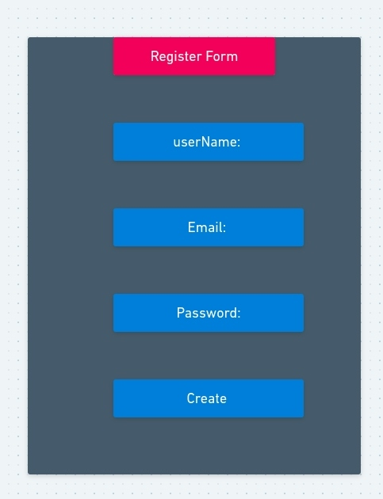

# Peeved
A top pet peeves blog application

## Members
- Rick Hertel   
- John Tran
- Abdi Osman

## Group Expectations


## MVP Goals

- Create MERN application and deploy via Heroku and Netlify
- Application will have full front-end and back-end CRUD functionality
- Application will have collections for both User and Posts
- Application will have JWT authorization, 
- Render application in browser
- The Peeved repo has a README.md that documents the project in detail

## Post-MVP Goals
- Allow users to make comments on any post if they are logged in
- Add Likes
- Hamburger menu
- Add dropdown/pop-up login on hover/click etc.
- Additional styling, animations
- Posts Search

## Database Schemas
```
userSchema
  {
    username: { type: String, required: true, unique: true },
    email: { type: String, required: true },
    password_digest: { type: String, required: true }
  }

postSchema
  {
    title: { type: String, required: true },
    content: { type: String, required: true },
    userId: { type: Schema.Types.ObjectId, ref: "User" }
  }
```

## MERN Chart


## Wireframes





## Component Hierarchy

# Peeved2
